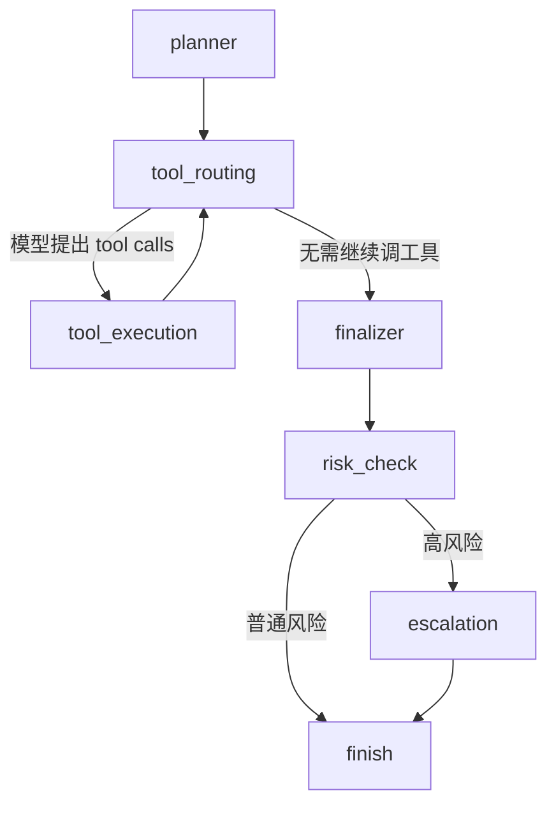



# MediEase

这是一个面向患者咨询场景的智能 Agent 后端项目，核心能力包括：

- 患者基础信息、病例、就诊记录管理
- Qwen 驱动的工具调用问答
- 基于 LangGraph 的多节点 Agent 工作流编排
- 基于 LangChain Retriever + FAISS 的知识库混合检索 / 向量 RAG
- 图片理解与语音播报
- 短期记忆与长期记忆
- 长期关键事件混合检索

补充文档：

- LangGraph 工作流说明：`docs/langgraph-agent-workflow.md`
- 产品需求文档：`docs/prd-patient-agent.md`

## 0. 当前技术亮点

这个项目现在已经不是“单纯的聊天接口”，而是一个比较完整的医疗场景 Agent 原型。对外保留 FastAPI API 和业务 service 层不变，对内把编排层升级为了更适合简历和面试表述的标准化架构：

1. Agent 编排层：
   - 使用 LangGraph 把执行流拆成 `planner -> tool_routing -> tool_execution -> finalizer -> risk_check -> escalation`
   - 支持显式状态流、条件分支、人工升级
2. 检索增强层：
   - 长期记忆继续使用自研 `FAISS + SQLite` 混合检索
   - 知识库链路升级为 `keyword + vector` 混合检索
   - 对外暴露 LangChain 风格 Retriever，便于后续扩展更完整的 RAG
3. 医疗安全层：
   - 查询前后都做风控检查
   - 高风险问题自动生成风险提示、免责声明和人工升级事件

## 0.1 LangGraph 工作流概览



每个节点的职责：

1. `planner`
   - 结合用户问题、图片、短期记忆、长期画像和关键事件生成最小执行计划。
2. `tool_routing`
   - 让模型决定当前是否继续调工具。
3. `tool_execution`
   - 做统一参数归一化、权限校验、审计落库。
4. `finalizer`
   - 基于证据收敛最终回答。
5. `risk_check`
   - 做后置医疗安全检查，并按需追加免责声明。
6. `escalation`
   - 在高风险场景下创建人工升级事件。

## 0.2 知识库 RAG 链路概览

当前知识库链路不再只是关键词搜索，而是标准的“混合检索 + Retriever”模式：

1. 知识库文档写入 SQLite。
2. 启用文档同步到本地 FAISS 向量索引。
3. 查询时并行执行：
   - 关键词召回
   - 向量召回
4. 合并结果并打上：
   - `keyword`
   - `vector`
   - `hybrid`
5. LangChain Retriever 输出 `Document`，供 Agent / RAG 链路复用。

## 1. 项目如何启动

### 1.1 环境准备

建议使用 `Python 3.12` 和项目自带虚拟环境。

创建并激活虚拟环境：

```bash
python3 -m venv .venv
source .venv/bin/activate
```

安装依赖：

```bash
pip install -r requirements.txt
```

### 1.2 配置环境变量

如果你要使用 Qwen 问答、多模态理解、向量检索或语音播报，推荐直接在项目根目录创建一个 `.env` 文件。这样启动时会自动读取，不需要每次手工 `export`。

最简单的方式是直接复制模板：

```bash
cp .env.example .env
```

然后只改其中的 key 和需要的配置即可。

模板内容如下：

```bash
QWEN_API_KEY="你的 Qwen Key"
QWEN_MODEL="qwen-vl-plus-latest"
QWEN_TTS_MODEL="cosyvoice-v3-flash"
QWEN_TTS_VOICE="longanyang"
QWEN_EMBEDDING_MODEL="text-embedding-v4"
QWEN_EMBEDDING_DIMENSIONS="1024"
```

说明：

- `QWEN_API_KEY`：Qwen / DashScope Key，必填
- `QWEN_MODEL`：文本或图文问答模型，推荐 `qwen-vl-plus-latest`
- `QWEN_TTS_MODEL`：语音播报模型
- `QWEN_TTS_VOICE`：默认语音音色
- `QWEN_EMBEDDING_MODEL`：向量检索使用的 embedding 模型
- `QWEN_EMBEDDING_DIMENSIONS`：embedding 维度

### 1.3 启动 API 服务

执行：

```bash
python -m uvicorn app.main:app --reload
```

启动后默认访问地址：

- Swagger 文档：`http://127.0.0.1:8000/docs`
- 健康检查：`http://127.0.0.1:8000/api/health`

### 1.4 初始化和准备数据

项目默认使用 SQLite，本地数据库文件在：

- `data/patient_agent.db`

如果你要导入演示数据，可以执行：

```bash
sqlite3 data/patient_agent.db < scripts/seed_demo_data.sql
```

### 1.5 通过前端页面操作

项目已经内置前端页面。启动服务后，你可以直接在浏览器访问页面完成主要操作，不需要再单独启动前端项目，也不需要手工写脚本。

推荐的使用方式是：

1. 启动后端服务
2. 直接打开前端页面
3. 在页面上完成提问、图片上传、语音播报测试和数据查看

启动后可直接访问：

- Query 页面：`http://127.0.0.1:8000/query`
- Chat 页面：`http://127.0.0.1:8000/chat`

如果你当前是在本地联调，通常只需要：

- 先启动后端服务
- 然后直接打开浏览器访问上述页面
- 通过页面直接测试问答、多模态、记忆和数据管理功能

需要特别注意：

当前项目还没有实现用户注册、登录和自动登录态识别，所以系统无法在第一次对话时自动知道“你是谁”。

这意味着：

- 第一次和 Agent 对话时，建议主动把自己的身份信息一起写进问题里
- 这样 Agent 才能完成身份验证，并继续查询患者相关的隐私数据

第一次对话建议至少带上这些信息：

- 患者编号
- 手机号
- 身份证号

例如，王建国的首轮提问可以这样写：

```text
我是王建国，编号是P0003，手机号是13800000003，身份证号是310101195911051234，请帮我查询最近一次心内科复诊记录。
```

这样做的好处是：

1. Agent 能更快识别当前对应的是哪位患者
2. 身份验证工具可以直接完成校验
3. 后续查询病例、就诊记录、图片问答和记忆功能都会更顺畅

如果第一次对话没有提供这些信息，系统可能会先继续追问身份验证信息，而不会直接返回完整的患者数据。

### 1.6 启动后可以在前端完成的主要功能

启动完成后，前端页面通常可以直接操作这些能力：

1. 患者问答
2. 图片上传与图文问答
3. 语音播报
4. 患者、病例、就诊记录查看
5. 长期记忆偏好配置
6. 关键事件和用户画像相关功能

也就是说，日常联调时你主要通过前端页面操作即可，后端 API 会在页面交互时自动被调用。

## 2. 项目目录结构

下面是当前项目最重要的目录说明。

```text
.
├── app/
│   ├── api/
│   ├── db/
│   ├── llm/
│   ├── schemas/
│   ├── services/
│   └── static/
├── data/
├── docs/
├── scripts/
├── README.md
└── requirements.txt
```

### 2.1 `app/`

这是项目核心代码目录。

#### `app/api/`

放 FastAPI 路由，也就是所有对外接口入口。

最核心的文件是：

- `app/api/routes.py`

这里负责：

- 定义 Swagger 接口
- 接收请求
- 调用 service 层
- 编排 Query 主链路

#### `app/db/`

放数据库相关内容。

包括：

- 数据库连接
- SQLAlchemy 模型
- 建表初始化逻辑

常见文件：

- `app/db/session.py`
- `app/db/models.py`
- `app/db/init_db.py`

#### `app/llm/`

放大模型、多模态和语音相关能力。

目前主要包括：

- `qwen_client.py`
  - 封装 Qwen 文本/图文问答能力
- `qwen_mcp_agent.py`
  - 封装 Agent 主执行链路，包括 Planner、工具调用和 Finalizer
- `qwen_speech_client.py`
  - 封装语音合成能力

#### `app/schemas/`

放 Pydantic 的请求和响应模型。

作用是：

- 约束接口输入输出
- 让 Swagger 文档清晰可见

这里可以看到每个接口到底接受什么字段、返回什么字段。

#### `app/services/`

放业务逻辑层，是这个项目最重要的一层之一。

这里负责真正处理：

- 患者 CRUD
- 病例 CRUD
- 就诊记录 CRUD
- 短期记忆读写
- 长期记忆提炼
- 长期关键事件混合检索
- 向量索引写入和查询

常见文件：

- `patient_service.py`
- `medical_case_service.py`
- `visit_record_service.py`
- `conversation_memory_service.py`
- `memory_service.py`
- `memory_preference_service.py`
- `memory_vector_service.py`

#### `app/static/`

预留的静态资源目录。

当前项目主要的媒体文件实际上放在 `data/` 下面，并通过 `/media` 暴露。

### 2.2 `data/`

放运行时数据。

包括：

- `patient_agent.db`
  - SQLite 主数据库
- `generated_audio/`
  - 语音播报生成后的音频文件
- `faiss/`
  - 长期关键事件的 FAISS 向量索引和元数据

这个目录通常会在你跑接口时不断产生新文件。

### 2.3 `docs/`

放项目文档。

当前包括：

- `docs/prd-patient-agent.md`
  - 产品或需求说明
- `docs/interview-review-agent-architecture.md`
  - 面试复习文档，重点讲架构、记忆、Planner、MCP、多模态和 Query 主流程

### 2.4 `scripts/`

放辅助脚本。

当前包括：

- `scripts/seed_demo_data.sql`
  - 导入演示数据
- `scripts/test_qwen_agent.py`
  - 从终端测试 Qwen Agent

### 2.5 `README.md`

就是当前这个文件。

作用是：

- 让新同学快速知道项目怎么启动
- 让使用者知道有哪些关键目录

### 2.6 `requirements.txt`

放项目 Python 依赖。

安装环境时最先会用到它。

### 2.7 怎么理解这些目录的关系

可以用一句话记：

- `api` 负责接请求
- `schemas` 负责约束输入输出
- `services` 负责真正处理业务
- `llm` 负责模型和多模态能力
- `db` 负责存储
- `data` 负责运行时文件
- `docs` 负责说明文档
- `scripts` 负责辅助测试和初始化

