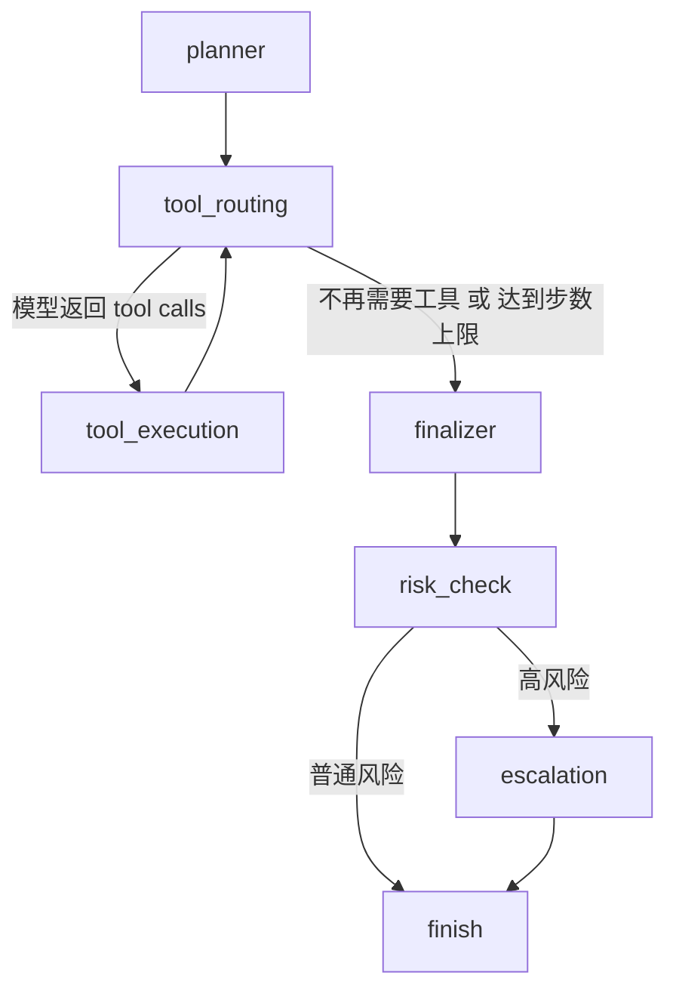
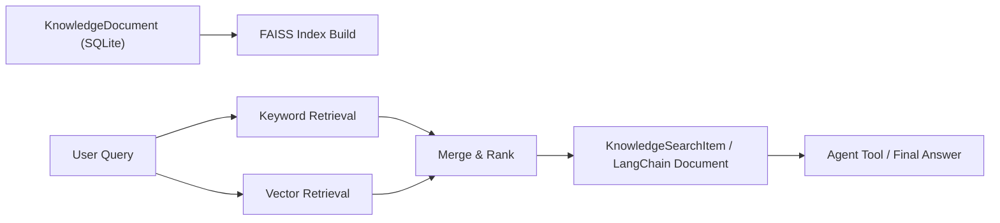

# MediEase 的 LangGraph 多节点工作流

## 1. 文档目的

这份文档用于说明当前项目在迁移到 LangGraph 之后，Agent 编排层是如何组织的、各个节点分别负责什么、为什么这样拆分，以及它与知识库向量 RAG 链路之间是什么关系。

这份说明可以直接用于：

1. README 补充说明
2. 面试讲解
3. 简历项目描述拆解
4. 后续向 Multi-Agent 扩展时的设计基线

## 2. 总体思路

当前项目没有推翻原来的业务底座，而是采用了“业务层保留、自研服务层保留、编排层迁移”的策略。

也就是说，下面这些层没有被重写：

1. 患者、病例、就诊记录、报告、记忆、审计、风控、人工升级等 `service` 层
2. SQLite、FAISS、本地文件系统
3. FastAPI 路由和现有 `/api/agent/query` 契约

真正迁移的是 Agent 内部控制流：

1. 旧版：手写 `Planner -> tool loop -> Finalizer`
2. 新版：LangGraph 显式状态图

## 3. 节点图

## 4. Graph State 设计

当前 LangGraph 工作流围绕统一的 `AgentGraphState` 运行，核心字段包括：

1. `user_query`
2. `images`
3. `memory_context`
4. `memory_context_summary`
5. `execution_plan`
6. `messages`
7. `tool_outputs`
8. `tool_steps`
9. `pending_tool_calls`
10. `draft_answer`
11. `answer`
12. `post_safety_assessment`
13. `manual_escalation`
14. `execution_trace`

这套状态的意义是：

1. 把原来散落在 route、agent、工具执行中的上下文统一起来。
2. 让每个节点只关心“读状态 -> 写状态”，降低耦合。
3. 后续如果要做 checkpoint、可视化 trace、多 Agent 分工，改造成本更低。

## 5. 节点职责

### 5.1 planner

职责：

1. 把短期记忆、长期画像、相关事件、风险提示压缩成 `memory_context_summary`
2. 多温度采样 Planner Prompt
3. 做自一致性合并，得到最小可执行计划
4. 初始化模型消息列表

输入：

1. 用户问题
2. 图片存在与否
3. 记忆上下文

输出：

1. `execution_plan`
2. `planner_debug`
3. `messages`

### 5.2 tool_routing

职责：

1. 把当前 `messages` 和工具 schema 送给模型
2. 判断这一轮是否需要继续调工具
3. 收集模型给出的 `tool_calls`

输出：

1. `pending_tool_calls`
2. `draft_answer`
3. `latest_response`

### 5.3 tool_execution

职责：

1. 统一处理工具参数归一化
2. 统一做权限校验
3. 统一做工具审计落库
4. 把工具结果写回 `messages`

这里复用的仍然是项目原有的：

1. `mcp_tool_service`
2. `tool_registry_service`
3. `tool_audit_service`

### 5.4 finalizer

职责：

1. 基于用户问题、执行计划、工具输出和草稿答案收敛最终回答
2. 确保回答只建立在已知证据之上

### 5.5 risk_check

职责：

1. 对最终答案做后置风险分析
2. 检查是否存在过度确定的诊断/停药/加药类表达
3. 必要时追加免责声明

### 5.6 escalation

职责：

1. 当风险等级达到阈值时创建人工升级事件
2. 把升级事件结构化写回最终返回结果

## 6. 为什么要迁到 LangGraph

对这个项目来说，迁移的价值不在于“为了简历硬套框架”，而在于 LangGraph 正好适合当前已经出现的复杂度。

### 6.1 显式工作流

原来控制流是写在函数里的，能跑，但执行路径是隐式的。迁到 LangGraph 后：

1. 节点和分支是显式的
2. 状态变化是显式的
3. 调试时能清楚看到经过了哪些节点

### 6.2 更适合扩展复杂分支

这个项目已经不再是单纯问答，而是同时有：

1. 权限控制
2. 报告解读
3. OCR
4. 风控
5. 人工升级
6. 记忆注入

这些都天然适合图式工作流。

### 6.3 更适合扩展到 Multi-Agent

当前仍然是单 Agent，但迁到 LangGraph 以后，后续很容易拆成：

1. 路由 Agent
2. 报告解读 Agent
3. 风控 Agent
4. 记录查询 Agent
5. 汇总 Agent

也就是说，LangGraph 不是 Multi-Agent 本身，但它是通往 Multi-Agent 的更自然底盘。

## 7. 知识库向量 RAG 是怎么接进来的

当前知识库链路已经升级成“关键词 + 向量”的混合检索模式。

流程如下：

### 7.1 文档写入

当知识库文档创建或更新时：

1. 先写 SQLite
2. 再尽量同步到本地 FAISS 索引

如果 embedding 环境不可用，则：

1. CRUD 仍然成功
2. 只是向量部分暂时退化

### 7.2 查询过程

查询时并行执行：

1. 关键词召回
2. 向量召回

然后合并成统一结果，并为每条结果打标签：

1. `keyword`
2. `vector`
3. `hybrid`

### 7.3 LangChain 接口

为了让知识库部分更贴近标准大模型应用开发实践，项目对外提供了 `KnowledgeBaseRetriever`：

1. 内部走混合检索
2. 对外输出 LangChain `Document`
3. 能直接接入 LangGraph / RAG chain / 后续 reranker

## 8. 对简历和面试的意义

如果要写在简历上，现在可以更准确地描述为：

1. 基于 LangGraph 实现医疗问答 Agent 的多节点状态化工作流
2. 保留自研业务 service 层，完成 Agent 编排层框架化升级
3. 基于 LangChain Retriever + FAISS + Qwen Embedding 实现知识库混合检索 / 向量 RAG
4. 支持工具调用、短长期记忆、风险控制和人工升级

相比只写“用了 LangChain / LangGraph”，这种写法更强，因为它强调的是：

1. 你理解为什么迁
2. 你知道迁哪一层
3. 你没有为了框架而推翻原有工程

## 9. 当前边界

这次升级已经把“LangGraph 工作流”和“知识库向量 RAG”补上了，但还存在这些边界：

1. 当前还是单 Agent，不是真正的 Multi-Agent 协同
2. 知识库向量检索已经落地，但还没有 reranker、chunking、复杂索引策略
3. 图执行可追踪，但还没接 LangSmith 一类可视化观测平台
4. 知识库向量索引当前是本地 FAISS，适合原型和作品，不是生产级分布式检索服务
